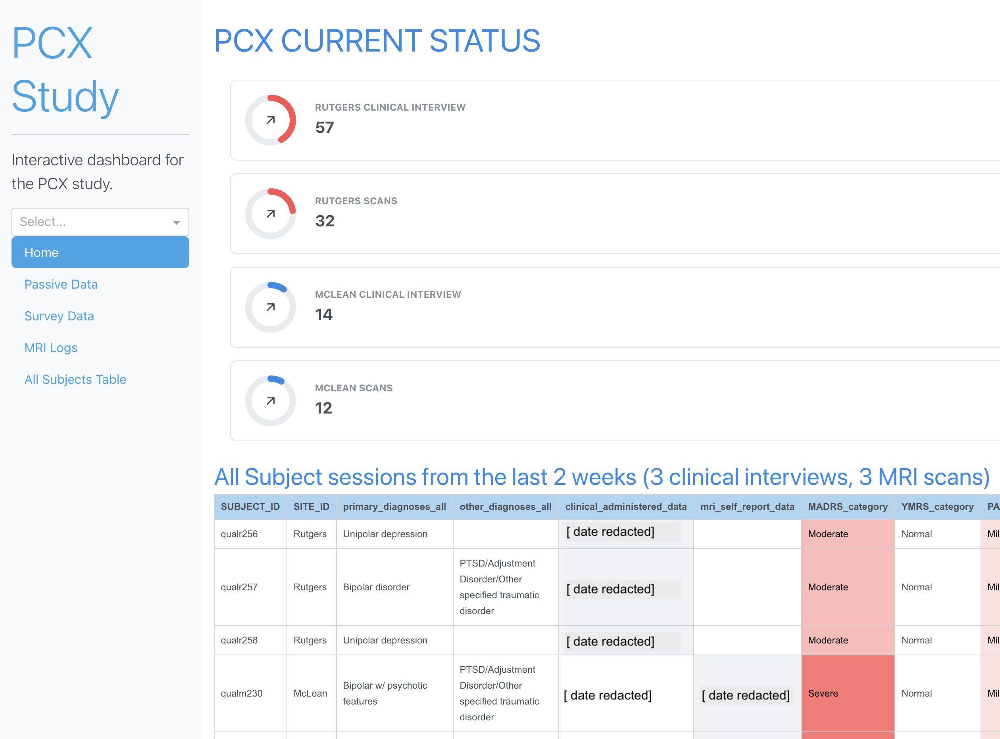
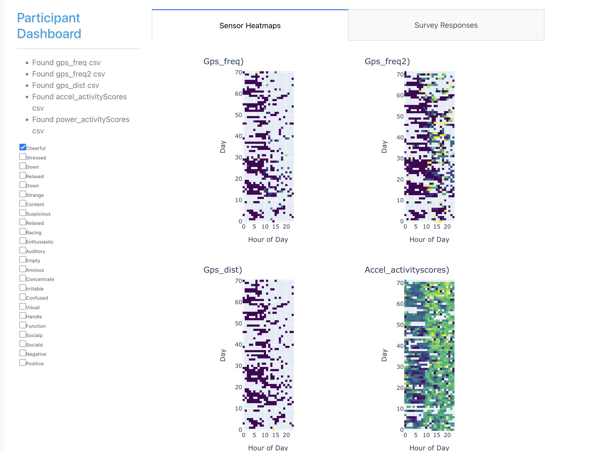
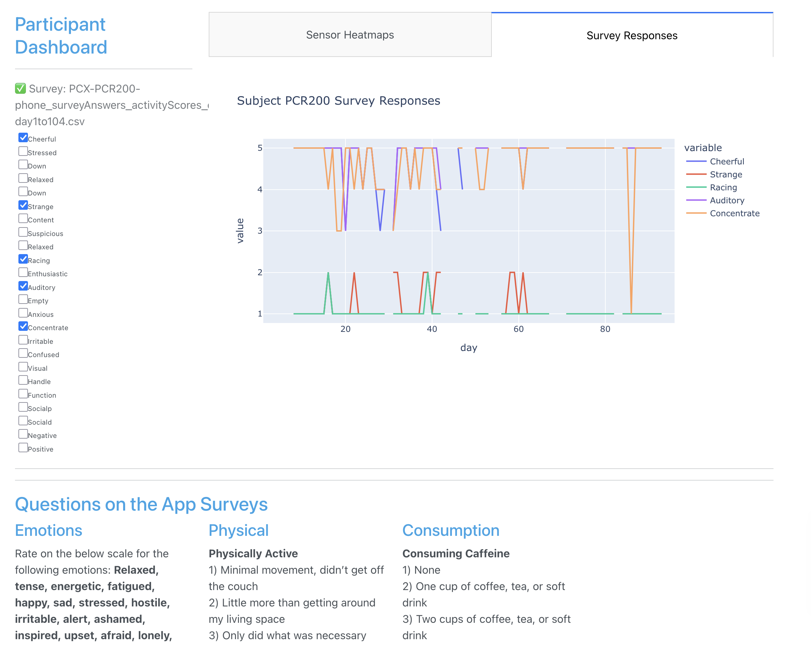
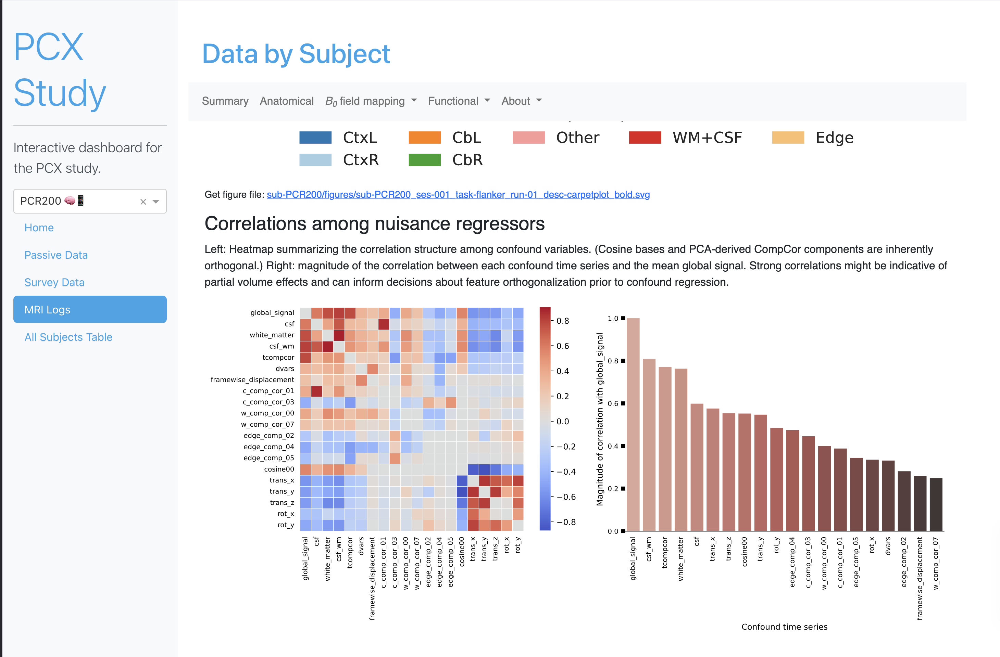
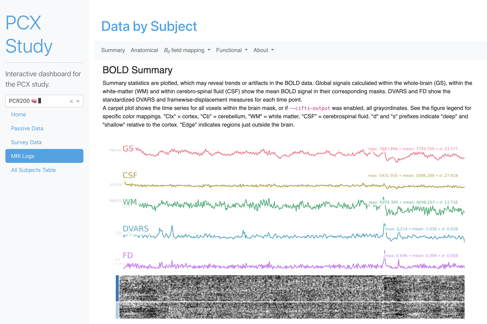
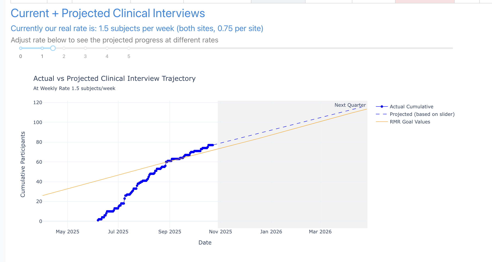

# PCX Dashboard Web App
A lightweight flask web app for comprehensive participant data visualization across a variety of data collection steps, ranging from fMRI analysis to smartphone sensor tracking.

This dashboard links specifically to data within the Holmes Lab Wiki and restricted folders, only accessible to Holmes Lab and PCX study staff. 

# Note: this web app runs locally on study staff computers, and is not hosted on the web, for privacy reasons.

## Setup
To run this app, first open up your terminal, and clone this directory. 
`git clone https://github.com/kaleyjoss/PCX_dashboard_stable`

If you have conda set up, you can create a virtual environment:

```bash
conda env create --name dashboard -f environment.yml
conda activate dashboard 
```

Or, install the following packages with whatever package manager you use:
pandas                    2.3.3           
numpy                     2.3.3           
dash                      2.14.2
(*This was originally developed with Python 3.13.9)

## Run app
Then, in the app directory, run this: (--debug is optional, helps with tracebacks and errors)
```bash
flask --app app.py run --debug --port 5000
```

You should have an output which says: 
```bash
Dash is running on http://127.0.0.1:5000

 * Serving Flask app 'app.py'
 * Debug mode: on
```

Now navigate to any browser, and go to: "http://127.0.0.1:5000"

You should see the app dashboard there. 

## Errors and troubleshooting

- If there are any errors which crash the site, you'll see those errors populate in the terminal or the site.

- If there are errors but the site is still running, go to the URL http://127.0.0.1:5000 and check the "Callbacks" popup to see what the errors are. 

- If it can't find a specific file/path, or you move/rename a file/folder, change the relevant filepaths in /scripts/paths.py

## App Visuals

### Homepage


### Smartphone Sensor Activity Heatmaps


### Daily Survey Interactive Charts


### fMRI Visualization and QC Metrics



### Interactive Collection Rate Projections
